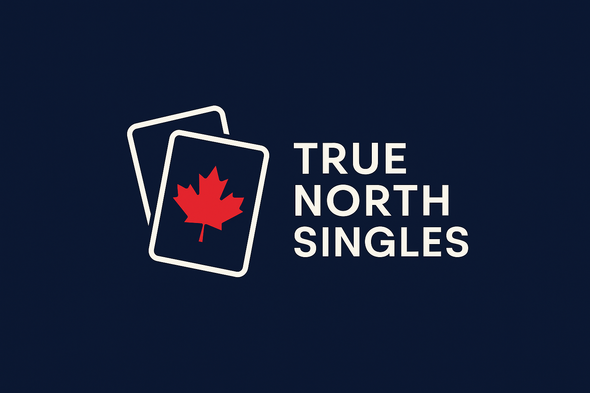

# TrueNorthSingles – TCG Price & Inventory Analytics
_Last-sold prices & ROI dashboards for Magic: the Gathering, Pokémon, and other Trading Card Games._

  

## 🚀 Key Features
- **Real-time last-sold price & date** pulled from eBay Marketplace Insights  
- **USD → CAD conversion** with live Bank of Canada rates  
- **ROI calculators** that compare purchase price vs. market value  
- **Per-card dashboards** embedded in Google Sheets  
- **Upcoming (Q1 2026):** one-click “List on eBay” action with pre-filled condition, finish & price

## 🔍 How We Use eBay Data
We call the *Marketplace Insights* API ≤ **2 000 requests per day**, cache the data for **< 24 h**, and display only non-PII public sales information—all in line with eBay’s [API Terms](https://developer.ebay.com/api-docs/static/versioning.html).

| Stage | Milestone | ETA |
|-------|-----------|-----|
| MVP   | Internal price tracker       | ✔️ Live |
| v1.0  | Public price-guide widget    | Jan 2026 |
| v1.5  | Consignor login portal       | Apr 2026 |
| v2.0  | Automated eBay listing flow  | 2026 |

## 📬 Contact
**Email us:** [truenorthsingles@gmail.com](mailto:truenorthsingles@gmail.com)  
**GitHub:** [TrueNorthSingles](https://github.com/TrueNorthSingles)

---

© 2025 TrueNorthSingles. All product names are trademarks of their respective owners.
